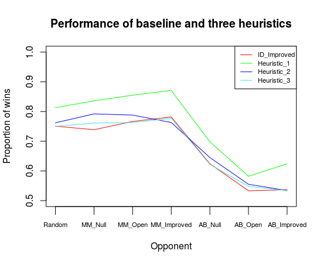

# Heuristic analysis

I have found it very **hard to improve on improved_score**. Both because it is very fast, and because it captures the essential intuition about the goodness of the board state: the advantage of a player over their opponent in terms of the number of extra moves available to the player. I have implemented a number of other heuristic functions which build on improved_score and try to refine it by adding more information to it. However, overall they seem not to add as much as I had expected to improved_score in the long run.

I have evaluated the performance of each three heuristic functions during a **tournament of 1000 matches** played by the Student player against each of the following seven competitors:

+ **Random:** An agent that randomly chooses a move each turn.
+ **MM_Null:** CustomPlayer agent using fixed-depth minimax search and the null_score heuristic
+ **MM_Open:** CustomPlayer agent using fixed-depth minimax search and the open_move_score heuristic
+ **MM_Improved:** CustomPlayer agent using fixed-depth minimax search and the improved_score heuristic
+ **AB_Null:** CustomPlayer agent using fixed-depth alpha-beta search and the null_score heuristic
+ **AB_Open:** CustomPlayer agent using fixed-depth alpha-beta search and the open_move_score heuristic
+ **AB_Improved:** CustomPlayer agent using fixed-depth alpha-beta search and the improved_score heuristic

In each of the three tournaments, the baseline player (ID_Improved) also played 1000 matches against each of the same seven competitors, which means the ID_Improved actually ended up playing 3000 matches in total. Each player's first move was always random, which accounts for part of the variation in results. Samples of size 1000 (for individual opponents) or 7000 (overall) are large enough to give a very reliable estimate of the performance in the long run. The tournaments were run on the same machine, in roughly similar conditions (although the first tournament had a bit of a handicap, as one fairly heavy application was also running all along, which was not the case for the other two tournaments). The machine is an HP EliteBook with an Intel(R) Core(TM) i7-4600U 2.10GHz CPU and 16 GB of RAM, running Ubuntu 16.04.

The **rationale behind the tree proposed functions** is: 

+ **Heuristic 1:** favour different strategies depending on the stage of the game. In early game, try to stay in the middle; in mid game, try to stay close to the opponent; and in late game try to maximise the player's advantage.

+ **Heuristic 2:** minimise the opponent's number of moves. By dividing the player's advantage by the number of moves of the opponent, we penalise board states where the opponent has many moves available. This way, at equal advantage, the player should choose that board state where the opponent has fewer moves. Squaring (or cubing, etc.) the denominator increases the penalty more or less drastically. 

+ **Heuristic 3:** compute the player's advantage, but penalise it (by subtracting one) if at least one of the open moves can be blocked by the opponent on the next move. In addition, reward a position which blocks the opponent (i.e. it is placed at a location which is positioned an L-shaped move away from the opponent).

Here are the **overall average percentage of wins** in the three 1000-match tournaments. The figures for ID_Improved are averaged over all 7 * 3000 matches played.

| --- | ID_Improved | Heuristic_1 | Heuristic_2 | Heuristic 3 |
| ------------ | ------------ | ------------- | ------------ | ------------ |
| Estimate | 67.60 | **75.41** | 69.13 | 67.93 |
| 95% CI: lower bound | 67.45 | **75.14** | 68.87 | 67.68 |
| 95% CI: upper bound | 67.74 | **75.69** | 69.39 | 68.18 ||

Table: Comparative performance of the baseline and the three heuristic functions overall

The graph below shows the **average proportion of wins against each opponent**. Again, for ID_Improved this is averaged over 3000, rather than 1000, matches each time. 

The data shows that the player using **Heuristic 1 is the best performing of all**. Its overall performance is significantly better than the baseline, at a confidence level of 95%. The other two players (Heuristics 2 and 3) perform less well, although they are still just on a par with ID_Improved. Heuristic 3's performance is not significantly different from that of the baseline at a confidence level of 95% (the two confidence intervals overlap), while Heuristic 2 does seem to be significantly better, although with a very small margin.

Interestingly, the curves in the breakdown by opponent exhibit a similar trend. All the players struggle most against the AB family of opponents, and especially against AB_Open. Heuristic 1 is the only player that does much better against AB_Improved than against AB_Open.

In view of these results, the **best performing** heuristic function appears to be **Heuristic 1**, which significantly outperforms the baseline. I should recommend that this heuristic be used. I ascribe its improved performance to its selectively taking into account information which may be more relevant at one stage of the game than another.
